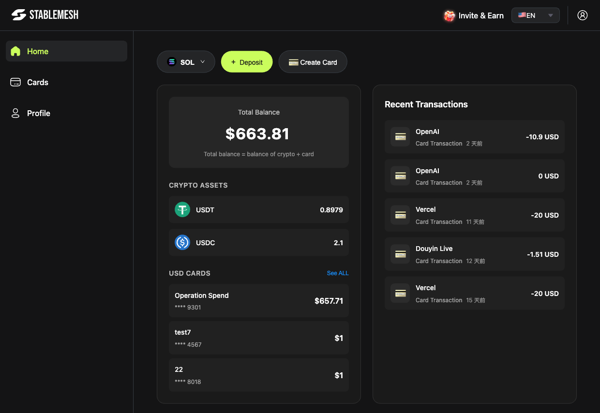

# Welcome to Stable Mesh

Stable Mesh is a **virtual credit card (VCC) platform** that bridges your crypto holdings with real-world spending. Fund Mastercard-powered virtual cards using on-chain stablecoins (USDT, USDC) and spend them anywhere Mastercard is accepted — online and in-store, globally.

> 🌐 [中文版本](zh/README.md)

---

## Who We Serve

Stable Mesh is built for anyone who needs a reliable, crypto-funded payment solution for global use:

| Who | How Stable Mesh Helps |
|-----|-----------------------|
| **Overseas Enterprises** | Pay international vendors, SaaS tools, and platforms without bank friction or cross-border fees |
| **Advertising Agencies** | Run ad spend on Google, Meta, TikTok, and more — fund multiple cards for different campaigns and clients |
| **Web3 Users** | Turn on-chain USDT/USDC into spendable Mastercard purchasing power, no bank account required |
| **Game Industry Enterprises** | Subscribe to Steam, run game ads on major platforms, and manage studio payments — all from a single card |

---

## Why Choose Stable Mesh

- **Low price, no hidden fees** — transparent flat-rate pricing with no surprise charges on top-ups, conversions, or transactions
- **Widely accepted & stable** — Mastercard network acceptance worldwide, with rock-solid card reliability
- **Fast crypto top-ups** — deposit USDT or USDC and spend within minutes
- **Rebates up to 2%** — earn cashback on spending through our affiliate and rebate program; [learn more](affiliate.md)

---

## What You Can Do

| Feature | Description |
|---------|-------------|
| **Virtual Cards** | Create and manage multiple Mastercard virtual cards |
| **Crypto Funding** | Top up cards instantly with USDT or USDC |
| **Global Spending** | Use your cards everywhere Mastercard is accepted |
| **Card Controls** | Freeze, unfreeze, and monitor cards in real-time |
| **Transaction History** | Full per-card spending logs |
| **Invite & Earn** | Refer friends and earn rewards |

---

## Quick Links

<table data-view="cards">
  <thead>
    <tr>
      <th></th>
    </tr>
  </thead>
  <tbody>
    <tr>
      <td><a href="getting-started.md"><strong>🚀 Getting Started</strong></a> Set up your account and fund your first card</td>
    </tr>
    <tr>
      <td><a href="cards/README.md"><strong>💳 Managing Cards</strong></a> Create, top up, freeze and view your cards</td>
    </tr>
    <tr>
      <td><a href="deposit.md"><strong>⬇️ Deposit Crypto</strong></a> Fund your Stable Mesh wallet with stablecoins</td>
    </tr>
  </tbody>
</table>

---

> **Need help?** Contact the Stable Mesh team through the official support channels.
