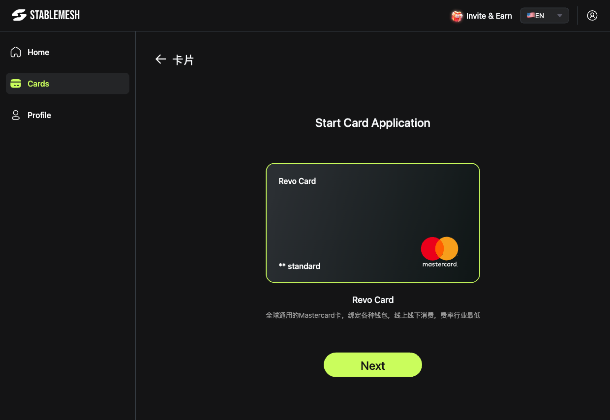

# Create a Card

Stable Mesh lets you issue multiple virtual Mastercards — each with its own balance, spending controls, and transaction history.

---

## How to Create a Card

1. Go to the **Cards** page (left sidebar).
2. Click the **Create Card** button in the top-right corner.
3. The **Start Card Application** screen opens.
4. Select your card type — currently available:

### Revo Card

| Feature | Detail |
|---------|--------|
| **Network** | Mastercard |
| **Acceptance** | Global — online and in-store |
| **Fees** | Industry-lowest rates |
| **Type** | Standard virtual card |

5. Click **Next** and follow the on-screen steps to complete your card application.

---

## After Creating a Card

Your new card appears in the **Cards** list with an initial balance of **$0**.

To start using it:

1. [Top up the card](cards/top-up.md) with funds from your crypto wallet.
2. [View your card details](cards/sensitive-info.md) to get the card number, expiry, and CVV.

---


You can create multiple cards for different purposes — e.g. one for subscriptions, one for ad spend, one for team use.

