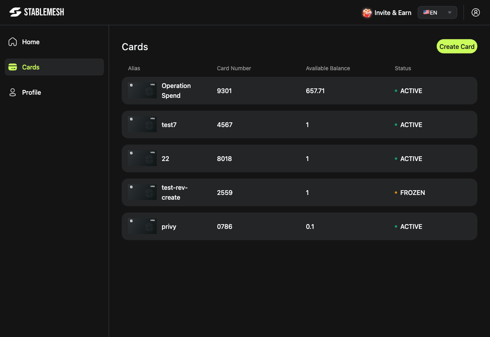
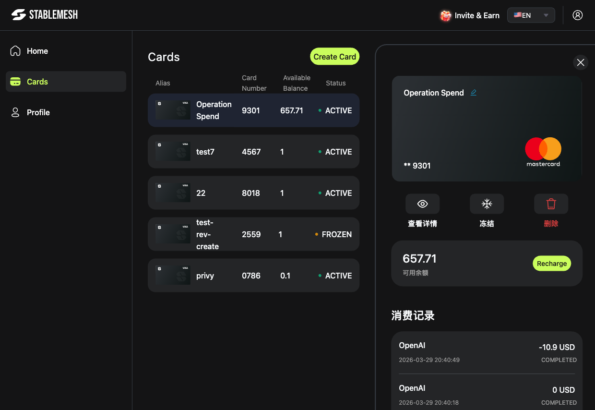

# 卡片管理

**卡片**模块让您管理所有 Stable Mesh 虚拟 Mastercard——查看余额、控制消费并监控动态。

---

## 卡片列表

点击左侧导航栏的**卡片**，查看您的所有虚拟卡。列表包含以下信息：

| 列名 | 说明 |
|------|------|
| **别名** | 您为卡片设置的名称 |
| **卡号** | 卡片后四位 |
| **可用余额** | 卡片当前可消费的美元金额 |
| **状态** | `ACTIVE`（绿色）或 `FROZEN`（橙色）|

---

## 卡片详情面板

点击任意卡片行，右侧弹出详情面板。

面板显示内容：

- **卡片图片** — 遮蔽部分卡号及网络标识（Mastercard）
- **操作按钮** — 查看信息、冻结/解冻、删除
- **可用余额** — 包含充值按钮
- **交易记录** — 可向下滚动查看完整消费日志

---

## 卡片操作

| 操作 | 说明 |
|------|------|
| [查看敏感信息](sensitive-info.md) | 显示完整卡号、有效期和 CVV |
| [冻结 / 解冻](freeze-unfreeze.md) | 即时锁定或恢复消费功能 |
| [充值](top-up.md) | 从加密钱包转入资金 |
| [查看交易记录](transactions.md) | 浏览卡片消费历史 |
