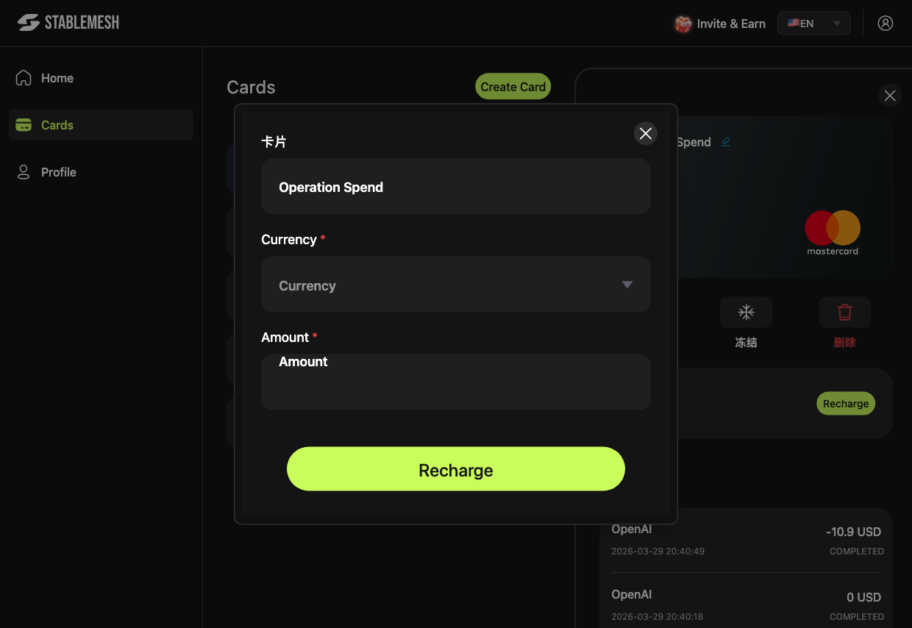
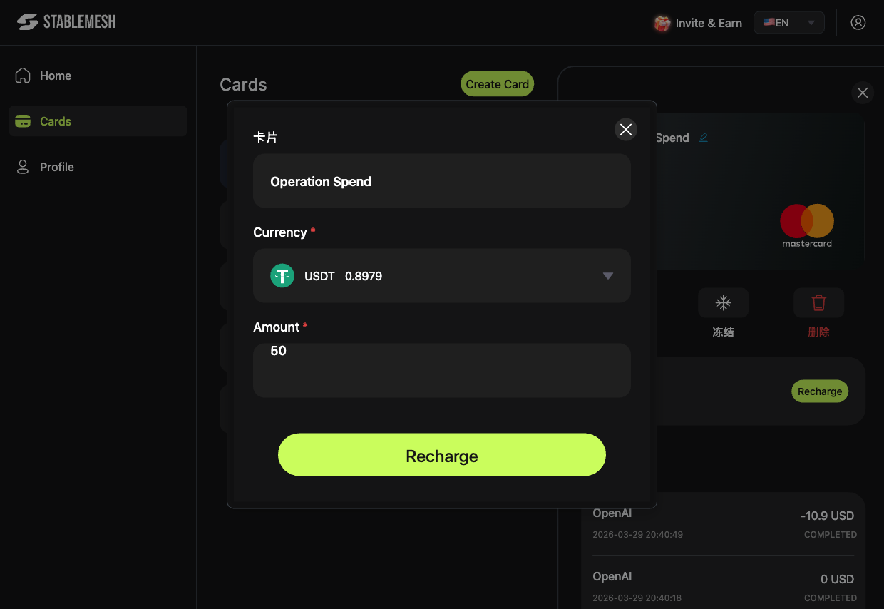

# 卡片充值

将资金从 Stable Mesh 加密钱包转入指定虚拟卡，即可开始消费。

---

## 充值步骤

1. 进入**卡片**页面，点击您要充值的卡片。
2. 在详情面板中，点击绿色的**充值**按钮。
3. 在弹出的窗口中：
   - **卡片** — 自动填入所选卡片名称。
   - **币种** — 从下拉菜单选择 `USDT` 或 `USDC`，旁边显示各币种的可用余额。
   - **金额** — 输入要充入卡片的美元金额。
4. 点击**充值**确认。

---

## 充值后

- 对应金额将**立即从加密钱包扣除**。
- 卡片的**可用余额**即时更新。
- 卡片可立即投入使用。

---


充值仅限使用 Stable Mesh 加密钱包中的现有资金。如钱包余额不足，请先[充值加密货币](../deposit.md)。


---

## 最低与最高限额

具体的最低或最高充值限额请在应用内查看，限额可能因账户而异。
